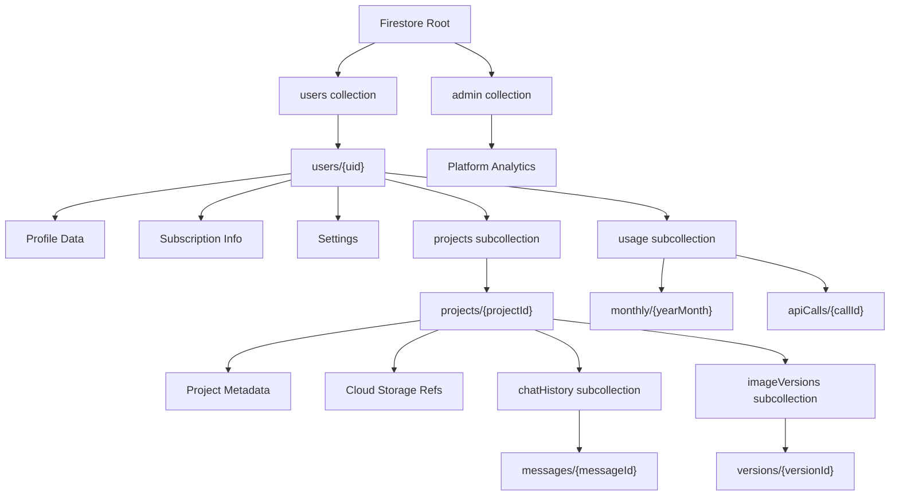

# Firestore Schema Documentation

## Overview

This document defines the complete Firestore database schema for the Thumio YouTube Thumbnail Editor platform. The schema follows Firebase best practices with all user data scoped under `users/{uid}` for security and scalability.

## Schema Architecture



## Collection Structure

### Root Collections

#### `users/{uid}`

The main user document containing profile, subscription, and settings data.

**Path**: `users/{uid}`

**Fields**:

| Field | Type | Description | Required |
|-------|------|-------------|----------|
| `email` | `string` | User's email address | Yes |
| `displayName` | `string` | User's display name | No |
| `photoURL` | `string` | URL to user's profile photo | No |
| `createdAt` | `timestamp` | Account creation timestamp | Yes |
| `updatedAt` | `timestamp` | Last update timestamp | Yes |
| `lastLoginAt` | `timestamp` | Last login timestamp | No |
| `subscription` | `object` | Subscription information | Yes |
| `subscription.tier` | `string` | Subscription tier: `free`, `basic`, `pro`, `business` | Yes |
| `subscription.status` | `string` | Status: `active`, `cancelled`, `expired`, `trial` | Yes |
| `subscription.startedAt` | `timestamp` | Subscription start date | No |
| `subscription.expiresAt` | `timestamp` | Subscription expiration date | No |
| `subscription.stripeCustomerId` | `string` | Stripe customer ID | No |
| `subscription.stripeSubscriptionId` | `string` | Stripe subscription ID | No |
| `settings` | `object` | User preferences | Yes |
| `settings.defaultImageFormat` | `string` | Default format: `png`, `jpeg` | No |
| `settings.defaultImageQuality` | `number` | Default quality (1-100) | No |
| `settings.notifications` | `object` | Notification preferences | No |
| `settings.notifications.email` | `boolean` | Email notifications enabled | No |
| `settings.notifications.productUpdates` | `boolean` | Product update emails | No |
| `settings.ui` | `object` | UI preferences | No |
| `settings.ui.theme` | `string` | Theme preference: `dark`, `light`, `auto` | No |
| `apiKeyPreference` | `string` | Preferred API key source: `user`, `studio` | No |
| `onboardingCompleted` | `boolean` | Whether user completed onboarding | No |

**Example Document**:

```json
{
  "email": "user@example.com",
  "displayName": "John Doe",
  "photoURL": "https://example.com/photo.jpg",
  "createdAt": "2024-01-15T10:30:00Z",
  "updatedAt": "2024-01-20T14:22:00Z",
  "lastLoginAt": "2024-01-20T14:22:00Z",
  "subscription": {
    "tier": "pro",
    "status": "active",
    "startedAt": "2024-01-15T10:30:00Z",
    "expiresAt": "2025-01-15T10:30:00Z",
    "stripeCustomerId": "cus_abc123",
    "stripeSubscriptionId": "sub_xyz789"
  },
  "settings": {
    "defaultImageFormat": "png",
    "defaultImageQuality": 85,
    "notifications": {
      "email": true,
      "productUpdates": true
    },
    "ui": {
      "theme": "dark"
    }
  },
  "apiKeyPreference": "user",
  "onboardingCompleted": true
}
```

---

### Subcollections

#### `users/{uid}/projects/{projectId}`

Stores individual thumbnail editing projects.

**Path**: `users/{uid}/projects/{projectId}`

**Fields**:

| Field | Type | Description | Required |
|-------|------|-------------|----------|
| `name` | `string` | Project name | Yes |
| `originalImageUrl` | `string` | Cloud Storage URL of original uploaded image | Yes |
| `currentImageUrl` | `string` | Cloud Storage URL of current edited image | Yes |
| `currentImageVersionId` | `string` | Reference to current version in imageVersions | No |
| `originalMimeType` | `string` | MIME type of original image | Yes |
| `currentMimeType` | `string` | MIME type of current image | Yes |
| `createdAt` | `timestamp` | Project creation timestamp | Yes |
| `updatedAt` | `timestamp` | Last update timestamp | Yes |
| `thumbnailUrl` | `string` | Cloud Storage URL of thumbnail (optional) | No |
| `isArchived` | `boolean` | Whether project is archived | No |
| `tags` | `array<string>` | User-defined tags for organization | No |

**Example Document**:

```json
{
  "name": "My Awesome Thumbnail",
  "originalImageUrl": "gs://thumio-images/user123/projects/proj456/original.jpg",
  "currentImageUrl": "gs://thumio-images/user123/projects/proj456/versions/version789.jpg",
  "currentImageVersionId": "version789",
  "originalMimeType": "image/jpeg",
  "currentMimeType": "image/png",
  "createdAt": "2024-01-18T09:15:00Z",
  "updatedAt": "2024-01-20T11:30:00Z",
  "thumbnailUrl": "gs://thumio-images/user123/projects/proj456/thumb.jpg",
  "isArchived": false,
  "tags": ["gaming", "youtube"]
}
```

---

#### `users/{uid}/projects/{projectId}/chatHistory/{messageId}`

Stores chat messages between user and AI for each project.

**Path**: `users/{uid}/projects/{projectId}/chatHistory/{messageId}`

**Fields**:

| Field | Type | Description | Required |
|-------|------|-------------|----------|
| `author` | `string` | Message author: `user` or `ai` | Yes |
| `text` | `string` | Message text content | No |
| `imageVersionId` | `string` | Reference to image version if message includes image | No |
| `imageUrl` | `string` | Cloud Storage URL if message includes image | No |
| `prompt` | `string` | User's edit prompt (for user messages) | No |
| `createdAt` | `timestamp` | Message timestamp | Yes |
| `isQuickAction` | `boolean` | Whether message was from quick action button | No |

**Example Document**:

```json
{
  "author": "user",
  "text": "Add dramatic outer glow to the subject",
  "prompt": "Add dramatic outer glow to the subject",
  "createdAt": "2024-01-18T09:20:00Z",
  "isQuickAction": false
}
```

```json
{
  "author": "ai",
  "text": "I've added an outer glow to the subject. Does it pop more now?",
  "imageVersionId": "version789",
  "imageUrl": "gs://thumio-images/user123/projects/proj456/versions/version789.jpg",
  "createdAt": "2024-01-18T09:20:05Z"
}
```

---

#### `users/{uid}/projects/{projectId}/imageVersions/{versionId}`

Stores version history of edited images for undo/redo functionality.

**Path**: `users/{uid}/projects/{projectId}/imageVersions/{versionId}`

**Fields**:

| Field | Type | Description | Required |
|-------|------|-------------|----------|
| `imageUrl` | `string` | Cloud Storage URL of this version | Yes |
| `mimeType` | `string` | MIME type of image | Yes |
| `editPrompt` | `string` | Prompt used to create this version | No |
| `geminiApiCallId` | `string` | Reference to API call in usage tracking | No |
| `createdAt` | `timestamp` | Version creation timestamp | Yes |
| `versionNumber` | `number` | Sequential version number (0 = original) | Yes |
| `parentVersionId` | `string` | Reference to parent version (for undo/redo) | No |
| `metadata` | `object` | Additional metadata | No |
| `metadata.aspectRatio` | `string` | Image aspect ratio (e.g., "16:9") | No |
| `metadata.dimensions` | `object` | Image dimensions | No |
| `metadata.dimensions.width` | `number` | Image width in pixels | No |
| `metadata.dimensions.height` | `number` | Image height in pixels | No |
| `metadata.fileSize` | `number` | File size in bytes | No |

**Example Document**:

```json
{
  "imageUrl": "gs://thumio-images/user123/projects/proj456/versions/version789.png",
  "mimeType": "image/png",
  "editPrompt": "Add dramatic outer glow to the subject",
  "geminiApiCallId": "call_abc123",
  "createdAt": "2024-01-18T09:20:05Z",
  "versionNumber": 3,
  "parentVersionId": "version456",
  "metadata": {
    "aspectRatio": "16:9",
    "dimensions": {
      "width": 1920,
      "height": 1080
    },
    "fileSize": 524288
  }
}
```

---

#### `users/{uid}/usage/monthly/{yearMonth}`

Aggregated monthly usage statistics for billing and analytics.

**Path**: `users/{uid}/usage/monthly/{yearMonth}` (format: `YYYY-MM`, e.g., `2024-01`)

**Fields**:

| Field | Type | Description | Required |
|-------|------|-------------|----------|
| `yearMonth` | `string` | Year-month identifier (YYYY-MM) | Yes |
| `apiCalls` | `number` | Total API calls this month | Yes |
| `imagesCreated` | `number` | Total images edited/created | Yes |
| `storageUsedBytes` | `number` | Total storage used in bytes | Yes |
| `totalCost` | `number` | Total cost in USD | Yes |
| `geminiApiCost` | `number` | Gemini API costs in USD | Yes |
| `storageCost` | `number` | Cloud Storage costs in USD | Yes |
| `updatedAt` | `timestamp` | Last update timestamp | Yes |

**Example Document**:

```json
{
  "yearMonth": "2024-01",
  "apiCalls": 150,
  "imagesCreated": 150,
  "storageUsedBytes": 78643200,
  "totalCost": 0.97,
  "geminiApiCost": 0.95,
  "storageCost": 0.02,
  "updatedAt": "2024-01-20T14:22:00Z"
}
```

---

#### `users/{uid}/usage/apiCalls/{callId}`

Detailed log of individual Gemini API calls for debugging and cost tracking.

**Path**: `users/{uid}/usage/apiCalls/{callId}`

**Fields**:

| Field | Type | Description | Required |
|-------|------|-------------|----------|
| `projectId` | `string` | Project this call was for | Yes |
| `model` | `string` | Gemini model used (e.g., "gemini-2.5-flash-image") | Yes |
| `inputTokens` | `number` | Input tokens used | No |
| `outputTokens` | `number` | Output tokens used | No |
| `inputImageSize` | `number` | Input image size in bytes | No |
| `outputImageSize` | `number` | Output image size in bytes | No |
| `cost` | `number` | Cost of this call in USD | Yes |
| `success` | `boolean` | Whether call was successful | Yes |
| `error` | `string` | Error message if failed | No |
| `responseTimeMs` | `number` | API response time in milliseconds | No |
| `createdAt` | `timestamp` | Call timestamp | Yes |

**Example Document**:

```json
{
  "projectId": "proj456",
  "model": "gemini-2.5-flash-image",
  "inputTokens": 350,
  "outputTokens": 50,
  "inputImageSize": 524288,
  "outputImageSize": 786432,
  "cost": 0.00635,
  "success": true,
  "responseTimeMs": 2340,
  "createdAt": "2024-01-18T09:20:05Z"
}
```

---

### Admin Collections

#### `admin/analytics/{date}`

Platform-wide analytics aggregated by date.

**Path**: `admin/analytics/{date}` (format: `YYYY-MM-DD`)

**Fields**:

| Field | Type | Description | Required |
|-------|------|-------------|----------|
| `date` | `string` | Date identifier (YYYY-MM-DD) | Yes |
| `totalUsers` | `number` | Total active users | Yes |
| `newUsers` | `number` | New users registered | Yes |
| `totalProjects` | `number` | Total projects created | Yes |
| `totalApiCalls` | `number` | Total API calls | Yes |
| `totalRevenue` | `number` | Total revenue in USD | Yes |
| `totalCosts` | `number` | Total costs in USD | Yes |
| `updatedAt` | `timestamp` | Last update timestamp | Yes |

---

## Cloud Storage Structure

Images are stored in Google Cloud Storage (GCS) with the following bucket structure:

```
gs://thumio-images/
  └── {uid}/
      └── projects/
          └── {projectId}/
              ├── original.{ext}          # Original uploaded image
              ├── thumb.{ext}             # Thumbnail (optional)
              └── versions/
                  ├── {versionId}.{ext}   # Version 1
                  ├── {versionId}.{ext}   # Version 2
                  └── ...
```

**Storage Rules**:
- Original images: Stored at upload time
- Versions: Created for each edit operation
- Thumbnails: Optional, generated for faster loading in project lists

**Storage Costs** (Cloud Storage Standard):
- Storage: $0.020 per GB/month
- Egress: $0.087 per GB (first 1 GB free/month)
- Operations: $0.05 per 10,000 Class A operations

---

## TypeScript Interfaces

```typescript
// User Document
export interface UserDocument {
  email: string;
  displayName?: string;
  photoURL?: string;
  createdAt: Timestamp;
  updatedAt: Timestamp;
  lastLoginAt?: Timestamp;
  subscription: SubscriptionInfo;
  settings: UserSettings;
  apiKeyPreference?: 'user' | 'studio';
  onboardingCompleted: boolean;
}

export interface SubscriptionInfo {
  tier: 'free' | 'basic' | 'pro' | 'business';
  status: 'active' | 'cancelled' | 'expired' | 'trial';
  startedAt?: Timestamp;
  expiresAt?: Timestamp;
  stripeCustomerId?: string;
  stripeSubscriptionId?: string;
}

export interface UserSettings {
  defaultImageFormat?: 'png' | 'jpeg';
  defaultImageQuality?: number; // 1-100
  notifications?: {
    email?: boolean;
    productUpdates?: boolean;
  };
  ui?: {
    theme?: 'dark' | 'light' | 'auto';
  };
}

// Project Document
export interface ProjectDocument {
  name: string;
  originalImageUrl: string;
  currentImageUrl: string;
  currentImageVersionId?: string;
  originalMimeType: string;
  currentMimeType: string;
  createdAt: Timestamp;
  updatedAt: Timestamp;
  thumbnailUrl?: string;
  isArchived: boolean;
  tags?: string[];
}

// Chat Message Document
export interface ChatMessageDocument {
  author: 'user' | 'ai';
  text?: string;
  imageVersionId?: string;
  imageUrl?: string;
  prompt?: string;
  createdAt: Timestamp;
  isQuickAction?: boolean;
}

// Image Version Document
export interface ImageVersionDocument {
  imageUrl: string;
  mimeType: string;
  editPrompt?: string;
  geminiApiCallId?: string;
  createdAt: Timestamp;
  versionNumber: number;
  parentVersionId?: string;
  metadata?: {
    aspectRatio?: string;
    dimensions?: {
      width: number;
      height: number;
    };
    fileSize?: number;
  };
}

// Monthly Usage Document
export interface MonthlyUsageDocument {
  yearMonth: string; // YYYY-MM
  apiCalls: number;
  imagesCreated: number;
  storageUsedBytes: number;
  totalCost: number;
  geminiApiCost: number;
  storageCost: number;
  updatedAt: Timestamp;
}

// API Call Document
export interface ApiCallDocument {
  projectId: string;
  model: string;
  inputTokens?: number;
  outputTokens?: number;
  inputImageSize?: number;
  outputImageSize?: number;
  cost: number;
  success: boolean;
  error?: string;
  responseTimeMs?: number;
  createdAt: Timestamp;
}
```

---

## Firestore Security Rules

```javascript
rules_version = '2';
service cloud.firestore {
  match /databases/{database}/documents {
    
    // Helper function to check if user is authenticated
    function isAuthenticated() {
      return request.auth != null;
    }
    
    // Helper function to check if user owns the resource
    function isOwner(userId) {
      return isAuthenticated() && request.auth.uid == userId;
    }
    
    // User documents - users can read/write their own data
    match /users/{userId} {
      allow read, write: if isOwner(userId);
      
      // Projects subcollection
      match /projects/{projectId} {
        allow read, write: if isOwner(userId);
        
        // Chat history subcollection
        match /chatHistory/{messageId} {
          allow read, write: if isOwner(userId);
        }
        
        // Image versions subcollection
        match /imageVersions/{versionId} {
          allow read, write: if isOwner(userId);
        }
      }
      
      // Usage tracking subcollection
      match /usage/{document=**} {
        allow read: if isOwner(userId);
        allow write: if false; // Only backend can write usage data
      }
    }
    
    // Admin collection - only admins can access
    match /admin/{document=**} {
      allow read, write: if request.auth != null && 
        get(/databases/$(database)/documents/users/$(request.auth.uid)).data.subscription.tier == 'admin';
    }
  }
}
```

---

## Common Query Patterns

### Get all projects for a user (sorted by creation date)

```typescript
const projectsRef = collection(db, `users/${uid}/projects`);
const q = query(
  projectsRef,
  where('isArchived', '==', false),
  orderBy('createdAt', 'desc')
);
const snapshot = await getDocs(q);
```

### Get chat history for a project

```typescript
const chatRef = collection(db, `users/${uid}/projects/${projectId}/chatHistory`);
const q = query(chatRef, orderBy('createdAt', 'asc'));
const snapshot = await getDocs(q);
```

### Get image version history

```typescript
const versionsRef = collection(db, `users/${uid}/projects/${projectId}/imageVersions`);
const q = query(versionsRef, orderBy('versionNumber', 'asc'));
const snapshot = await getDocs(q);
```

### Get current month usage

```typescript
const yearMonth = new Date().toISOString().slice(0, 7); // YYYY-MM
const usageRef = doc(db, `users/${uid}/usage/monthly/${yearMonth}`);
const usageDoc = await getDoc(usageRef);
```

### Get recent API calls (last 100)

```typescript
const apiCallsRef = collection(db, `users/${uid}/usage/apiCalls`);
const q = query(
  apiCallsRef,
  orderBy('createdAt', 'desc'),
  limit(100)
);
const snapshot = await getDocs(q);
```

---

## Subscription Tiers & Limits

Based on cost analysis ($0.00635 per edit):

| Tier | Monthly Price | Edits/Month | Storage | Cost per Edit |
|------|--------------|-------------|---------|---------------|
| **Free** | $0 | 5 | 100 MB | N/A |
| **Basic** | $4.99 | 100 | 1 GB | $0.05 |
| **Pro** | $14.99 | 500 | 5 GB | $0.03 |
| **Business** | $49.99 | 2,000 | 20 GB | $0.025 |

**Implementation Notes**:
- Free tier: 5 edits/month, then requires upgrade
- Basic tier: 100 edits/month, ~$5 cost, ~$0 profit margin
- Pro tier: 500 edits/month, ~$3.18 cost, ~$11.81 profit margin
- Business tier: 2,000 edits/month, ~$12.70 cost, ~$37.29 profit margin

---

## Migration from localStorage

### Current localStorage Structure

```typescript
// Current Project interface (from types.ts)
interface Project {
  id: string;
  name: string;
  imageData: string; // base64 string
  mimeType: string;
  createdAt: number;
}
```

### Migration Steps

1. **Upload images to Cloud Storage**
   - Convert base64 strings to Blob
   - Upload to `gs://thumio-images/{uid}/projects/{projectId}/original.{ext}`
   - Store URL in Firestore

2. **Create project documents**
   - Map `localStorage` projects to Firestore `projects` subcollection
   - Replace `imageData` (base64) with `originalImageUrl` (GCS URL)

3. **Create initial image version**
   - Create version 0 (original) in `imageVersions` subcollection
   - Link to original image in Cloud Storage

4. **Migrate chat history** (if stored)
   - Create chat history documents from in-memory state
   - Link to appropriate image versions

### Migration Script Example

```typescript
async function migrateLocalStorageToFirestore(uid: string) {
  const localProjects = loadProjects(); // From projectService.ts
  
  for (const project of localProjects) {
    // Upload base64 image to Cloud Storage
    const imageBlob = base64ToBlob(project.imageData, project.mimeType);
    const storageRef = ref(storage, `${uid}/projects/${project.id}/original.jpg`);
    await uploadBytes(storageRef, imageBlob);
    const imageUrl = await getDownloadURL(storageRef);
    
    // Create project document
    const projectRef = doc(db, `users/${uid}/projects/${project.id}`);
    await setDoc(projectRef, {
      name: project.name,
      originalImageUrl: imageUrl,
      currentImageUrl: imageUrl,
      originalMimeType: project.mimeType,
      currentMimeType: project.mimeType,
      createdAt: Timestamp.fromMillis(project.createdAt),
      updatedAt: Timestamp.now(),
      isArchived: false
    });
    
    // Create initial version
    const versionRef = doc(db, `users/${uid}/projects/${project.id}/imageVersions/version0`);
    await setDoc(versionRef, {
      imageUrl: imageUrl,
      mimeType: project.mimeType,
      createdAt: Timestamp.fromMillis(project.createdAt),
      versionNumber: 0
    });
  }
}
```

---

## Index Requirements

### Composite Indexes Needed

1. **Projects query** (archived filter + date sort):
   ```
   Collection: users/{uid}/projects
   Fields: isArchived (Ascending), createdAt (Descending)
   ```

2. **API calls query** (date sort + limit):
   ```
   Collection: users/{uid}/usage/apiCalls
   Fields: createdAt (Descending)
   ```

3. **Image versions query** (version number sort):
   ```
   Collection: users/{uid}/projects/{projectId}/imageVersions
   Fields: versionNumber (Ascending)
   ```

### Creating Indexes

Indexes can be created:
- Automatically via Firebase Console when queries fail
- Manually via `firebase.json`:
  ```json
  {
    "firestore": {
      "indexes": {
        "indexes": [
          {
            "collectionGroup": "projects",
            "queryScope": "COLLECTION",
            "fields": [
              { "fieldPath": "isArchived", "order": "ASCENDING" },
              { "fieldPath": "createdAt", "order": "DESCENDING" }
            ]
          }
        ]
      }
    }
  }
  ```

---

## Best Practices

1. **Always use timestamps**: Use Firestore `Timestamp` type, not JavaScript `Date` objects
2. **Batch writes**: Group related writes in batches (max 500 operations)
3. **Use subcollections**: For scalable, hierarchical data (projects, messages, versions)
4. **Store references**: Store Cloud Storage URLs, not base64 data in Firestore
5. **Index queries**: Create indexes before deploying queries that need them
6. **Security rules**: Always validate user ownership in security rules
7. **Cost monitoring**: Track usage via `usage` subcollection for billing
8. **Version control**: Use `imageVersions` for undo/redo, not full history in memory

---

## Cost Optimization

1. **Image Storage**: Store images in Cloud Storage, not Firestore (10x cheaper)
2. **Pagination**: Use `limit()` and `startAfter()` for large collections
3. **Field selection**: Use `select()` to fetch only needed fields
4. **Caching**: Cache frequently accessed data client-side
5. **Batch operations**: Group writes to reduce read/write operations
6. **Archive old data**: Move old projects to archived state, consider cold storage

---

## References

- [Firestore Documentation](https://firebase.google.com/docs/firestore)
- [Cloud Storage Documentation](https://cloud.google.com/storage/docs)
- [Firestore Security Rules](https://firebase.google.com/docs/firestore/security/get-started)
- [Firestore Pricing](https://firebase.google.com/pricing)
- [Cloud Storage Pricing](https://cloud.google.com/storage/pricing)

